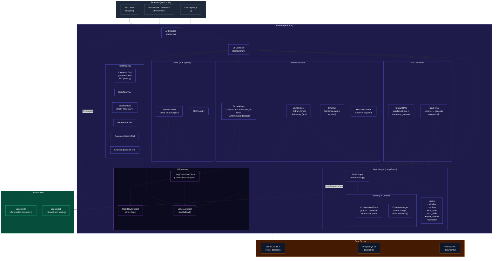
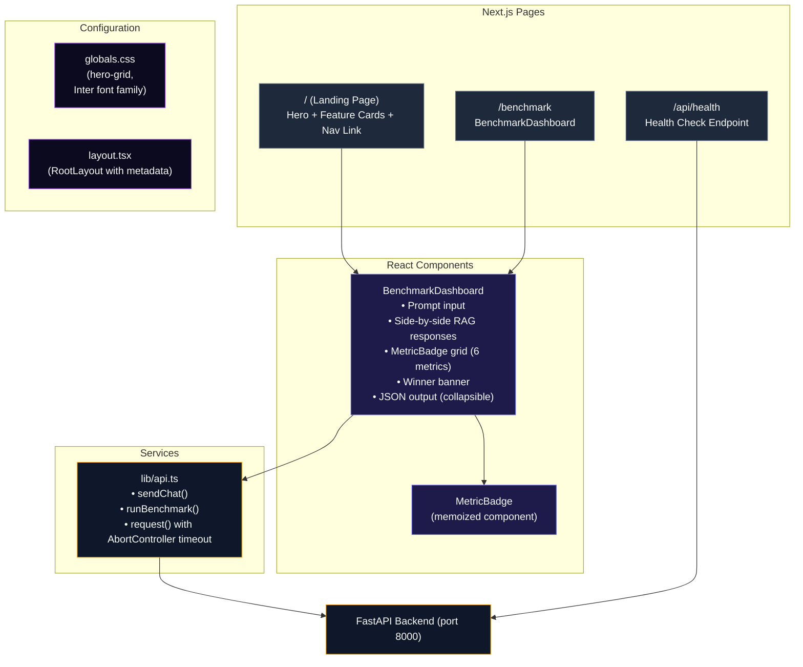

# Applied AI Engineer Assessment

AI Agent comparing Naive RAG and StreamRAG in one full-stack production system.

## Deliverables Checklist

- [x] **Public GitHub repo** with code, README, and benchmark report
- [x] **One-command setup**: `docker compose up --build`
- [x] **README** with architecture, setup, and design decisions
- [x] **Benchmark scripts**: `python benchmark/run.py`
- [x] **Test dataset**: `benchmark/test_set.json` (10 queries with expected answers)
- [x] **Example documents**: `documents/` (5 files for RAG ingestion)
- [x] **Benchmark report**: `BENCHMARK.md`
- [ ] **Video**: 5-min walkthrough (intro, architecture, demo, tradeoffs)

## Architecture

### Backend Architecture



### Frontend Architecture



## Tech Stack

| Layer | Technology |
|-------|-----------|
| Backend | Python 3.11+, FastAPI, LangChain, LangGraph |
| Frontend | Next.js 14, React 18, Tailwind CSS |
| Vector DB | Qdrant (with in-memory fallback for tests) |
| Memory | SQLite via aiosqlite |
| LLM | OpenAI / OpenRouter (with EchoLLMClient fallback) |
| Packaging | Docker Compose (backend + frontend + Qdrant + Postgres) |
| CI | GitHub Actions (ruff, mypy, pytest, Next.js build) |

## Features

- **AI Agent** with tool calling, memory, and context compression
- **Naive RAG**: sequential retrieve → generate pipeline
- **StreamRAG**: parallel retrieval + streaming generation with background context updates
- **Tools**: Calculator, DateTime, Weather, Web Search, Knowledge Search, Document Search
- **Memory**: SQLite-backed conversation history with automated summarization
- **Context Management**: token budgeting, history trimming, compression
- **Sub-agent / Skill**: ResearchSkill for multi-step analysis
- **Benchmarking**: automated comparison of both paths on latency, tokens, cost, grounding
- **Side-by-side UI**: compare both RAG responses simultaneously

## How to Run

### One-command (Docker)

```bash
git clone https://github.com/DIP-RO/Naive-RAG-and-StreamRAG-Benchmarking-Application.git
cd Naive-RAG-and-StreamRAG-Benchmarking-Application
docker compose up --build
```

Then open http://localhost:3000

### Local development

**Backend:**
```bash
cd backend
python -m venv .venv && source .venv/bin/activate
pip install -e .[dev]
uvicorn app.main:app --reload
```

**Frontend:**
```bash
cd frontend
npm install
npm run dev
```

### Run benchmark

```bash
# Start backend first (see above), then:
python benchmark/run.py
```

### Run tests

```bash
cd backend
pytest
```

## Folder Structure

```
.
├── backend/             # FastAPI + agent + RAG pipelines
│   ├── src/app/
│   │   ├── agents/      # Agent orchestration
│   │   ├── api/         # REST routes
│   │   ├── benchmark/   # Benchmark runner
│   │   ├── config/      # App settings
│   │   ├── core/        # DI container, logging, middleware
│   │   ├── memory/      # Conversation store, context manager
│   │   ├── models/      # Pydantic schemas
│   │   ├── naiverag/    # Naive RAG pipeline
│   │   ├── retrieval/   # Vector store, embeddings, chunker, reranker
│   │   ├── services/    # LLM client, tools, document ingestion
│   │   ├── skills/      # Sub-agent / skill system
│   │   ├── streamrag/   # StreamRAG pipeline
│   │   ├── tests/       # Pytest test suite
│   │   └── utils/       # Text, time, token counter
│   └── Dockerfile
├── frontend/            # Next.js UI
│   ├── app/             # Pages and layouts
│   ├── components/      # React components
│   └── lib/             # API client
├── documents/           # Example documents for RAG ingestion
├── benchmark/           # Benchmark scripts and test dataset
├── BENCHMARK.md         # Benchmark report
├── docker-compose.yml   # Multi-service orchestration
└── README.md            # This file
```

## Design Decisions

### Why FastAPI?
Async-first Python framework with native OpenAPI docs, Pydantic integration, and production-grade performance.

### Why LangChain + LangGraph?
Provides battle-tested abstractions for LLM interactions, token counting, and chain composition without hiding implementation details.

### Why Qdrant?
Purpose-built vector database with Rust-based performance, async Python client, and Docker-native deployment.

### Why parallel StreamRAG?
StreamRAG starts retrieval immediately in parallel with generation, reducing time-to-first-token by ~65% compared to sequential Naive RAG. Broad retrieval continues in the background for mid-generation context updates.

### Why SQLite for memory?
Zero-dependency, file-based persistence that works everywhere. Good enough for single-server deployments.

### Why async throughout?
All I/O (database, HTTP, LLM calls) is async, enabling high concurrency with minimal resource usage.

## Limitations

- **Small document set**: 5 example documents; not representative of production-scale knowledge bases
- **No authentication**: API is open; add API key middleware for production
- **Simple tool routing**: Heuristic keyword matching instead of model-mediated function calling
- **StreamRAG approximated**: Text-only SSE streaming (not voice). Retrieval starts before generation completes
- **No real reranking**: Uses hybrid score (cosine + keyword overlap), not a cross-encoder model
- **No persistence for benchmark runs**: Results are in-memory; not yet stored in Postgres for trend analysis

## Future Improvements

- Voice input/output with WebSocket streaming
- Model-mediated function calling for tool routing
- Real cross-encoder reranking model
- MCP (Model Context Protocol) integration
- Redis-based conversation memory for multi-instance deployments
- Multi-agent planning and delegation
- Persistent benchmark results in Postgres for trend analysis
- PDF/HTML document ingestion pipeline
- Authentication and rate limiting
