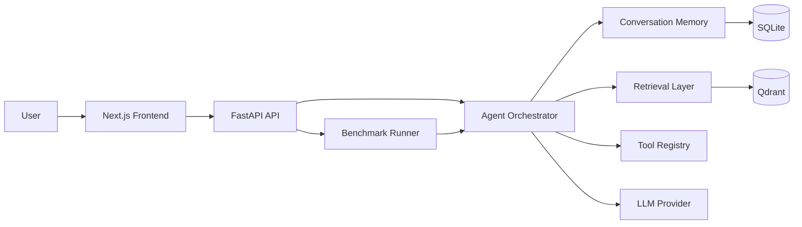

# Applied AI Engineer Assessment

**Candidate:** [Your Name]
**Repo:** https://github.com/DIP-RO/Naive-RAG-and-StreamRAG-Benchmarking-Application

Production-oriented full-stack AI agent comparing Naive RAG and StreamRAG in one system.

## Deliverables Checklist

- [x] **Public GitHub repo** with source code, README, and benchmark
- [x] **Two RAG paths**: Naive RAG (retrieve-then-answer) and StreamRAG (parallel retrieval + streaming)
- [x] **Tools**: Calculator, DateTime, Weather, WebSearch, KnowledgeSearch, DocumentSearch (6 tools)
- [x] **Memory**: SQLite-backed conversation history with summaries across turns
- [x] **Context management**: Token-budgeted trimming, summarization, and compression
- [x] **Sub-agent / Skill**: ResearchSkill — multi-step research analysis using the LLM
- [x] **Benchmark write-up**: `BENCHMARK.md` with test set, metrics, and analysis
- [x] **Reproducible benchmark**: `python backend/scripts/run_benchmark.py`
- [x] **Frontend**: Next.js app with side-by-side Naive RAG vs StreamRAG comparison
- [x] **Docker Compose**: One-command local run (`docker compose up --build`)
- [x] **CI**: GitHub Actions with ruff, mypy, pytest for backend; lint + build for frontend
- [ ] **Video**: 5-min walkthrough (covers intro, architecture, running demo, tradeoffs)

## What this repo demonstrates

- FastAPI backend with typed configuration, request-scoped logging, structured JSON logs, and async orchestration.
- Naive RAG and StreamRAG implemented as separate pipelines backed by shared retrieval, memory, and tool abstractions.
- Benchmarking focused on latency, TTFT, token usage, and a grounding-oriented summary.
- Next.js frontend that presents both RAG responses side-by-side for direct comparison.
- Docker Compose for local end-to-end execution and GitHub Actions CI for backend and frontend validation.

## Architecture



### Folder Structure

```text
backend/
  src/app/
    api/
    agents/
    benchmark/
    config/
    core/
    memory/
    models/
    naiverag/
    retrieval/
    services/
    streamrag/
    tests/
    utils/
frontend/
  app/
  components/
  lib/
.github/workflows/
```

## Installation

### Backend

Create a virtual environment when developing locally:

```bash
cd backend
python3.11 -m venv .venv
source .venv/bin/activate
pip install -e .[dev]
uvicorn app.main:app --reload
```

### Frontend

```bash
cd frontend
npm install
npm run dev
```

## Docker

```bash
docker compose up --build
```

Services:

- Frontend: http://localhost:3000
- Backend: http://localhost:8000/api
- Qdrant: http://localhost:6333
- Postgres: localhost:5432

## API

- `GET /api/health`
- `POST /api/chat`
- `POST /api/chat/stream`
- `POST /api/benchmark`
- `POST /api/documents/ingest`

## How StreamRAG Works

StreamRAG starts retrieval immediately, opens generation as soon as the initial context is ready, and continues broad retrieval in the background. New evidence can be emitted as context updates, which makes the system better suited for low-latency interactive experiences than a strictly synchronous retrieval-then-generate pipeline.

### Tradeoffs

- StreamRAG improves perceived responsiveness and can reduce time to first token.
- The implementation is more complex because it must manage concurrent retrieval, cancellation, and mid-stream context updates.
- Naive RAG is simpler and easier to reason about, so it remains a strong baseline for comparison and debugging.

## Benchmark

The benchmark endpoint runs both modes across repeated trials and records:

- latency
- time to first token
- retrieval time
- generation time
- prompt and completion tokens
- estimated cost
- grounding score and failure placeholders for evaluation hooks

### Reproducing the Benchmark

```bash
# 1. Start the backend
cd backend
python -m venv .venv && source .venv/bin/activate
pip install -e .[dev]
uvicorn app.main:app --host 0.0.0.0 --port 8000 &

# 2. Run the automated benchmark script
python scripts/run_benchmark.py
```

This runs 10 test queries (see `BENCHMARK.md`) through both RAG paths and outputs:

- Per-query latency breakdown
- Aggregated summary (avg/min/max latency, error count)
- Winner by latency
- Full JSON report at `benchmark_report.json`

### Test Set

The 10 queries exercise retrieval, calculator, datetime, weather, web search, and reasoning:

1. "What is the capital of France?"
2. "Calculate 2 + 3 * 4"
3. "What time is it right now?"
4. "Tell me about machine learning"
5. "Research the impact of climate change on agriculture"
6. "Search the web for latest AI news"
7. "What is the weather like?"
8. "Explain the difference between RAG and fine-tuning"
9. "Compare StreamRAG with naive RAG"
10. "What is 15% of 200?"

## Testing

```bash
cd backend
pytest
```

## Future Improvements

- Replace heuristic tool routing with model-mediated function calling and policy constraints.
- Add real reranking and grounded evaluation against a labeled dataset.
- Persist benchmark runs into Postgres for trend analysis and reporting.
- Add websocket streaming in addition to SSE for richer client interactivity.
- Expand the document ingestion layer to support PDFs, HTML, and OCR pipelines.
